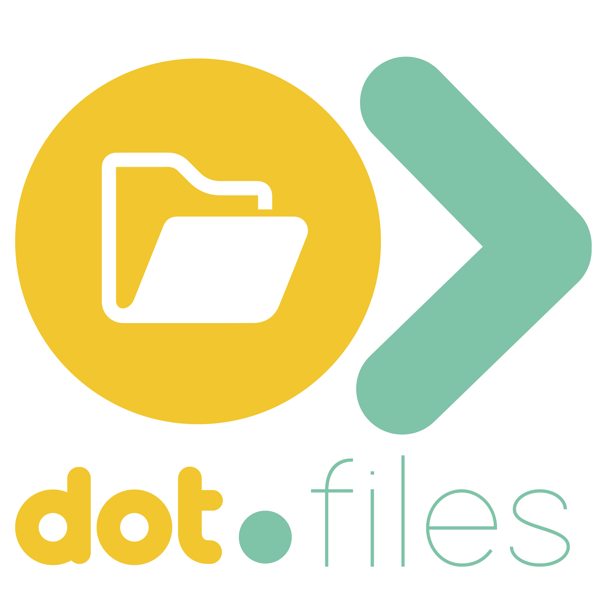

<h1>Dot.Files</h1>

Secure, team-based digital file storage and sharing — organise, collaborate, and access your documents anywhere.

---

## Overview

Dot.Files is the file storage and management platform in the Dot ecosystem. Teams upload, organise, preview, and share files with fine-grained access controls — backed by AWS S3 and accessible via single sign-on from InfoDot.

---

## Features

- Drag-and-drop file upload with progress tracking
- Folder hierarchy with team and personal spaces
- File previews for images, PDFs, and documents
- Granular permissions — view, edit, download, share
- Version history and restore
- Real-time collaboration notifications via Reverb
- Full-text file search via Laravel Scout
- Ecosystem SSO — authenticate from InfoDot with a single click

---

## Tech Stack

| Layer | Technology |
|---|---|
| Framework | Laravel 12 + PHP 8.4 |
| Frontend | Livewire 3 + Vite 6 + Tailwind CSS 3.4 |
| Auth | Jetstream 5 + Sanctum (ecosystem SSO) |
| Database | PostgreSQL 16 (shared infodot instance) |
| Storage | AWS S3 via Laravel Flysystem |
| WebSockets | Laravel Reverb |

---

## Quick Start

\`\`\`bash
git clone https://github.com/sakhileb/Dot.Files.git && cd Dot.Files
composer install && npm install
cp .env.example .env && php artisan key:generate
php artisan migrate && npm run dev & php artisan serve
\`\`\`

\`\`\`bash
bash bin/test.sh   # Run tests
\`\`\`

---

## Part of the Dot Ecosystem

Dot.Files connects to [InfoDot](https://github.com/sakhileb/InfoDot) — the central hub. Log in to InfoDot once and navigate here without re-authenticating via \`/auth/ecosystem\`.

---

MIT — © SK Digital / BluPin Incorporated
